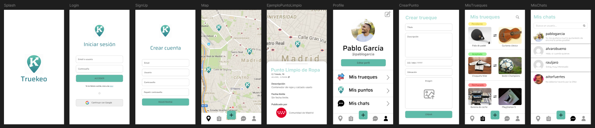

# Truekeo 🌍

**Dale una segunda vida a lo que te rodea. Conecta, dona y transforma tu barrio.**

## 📝 Descripción
**Truekeo** es una plataforma de economía circular diseñada para facilitar la donación y el trueque a nivel local. A través de un mapa interactivo en tiempo real, los usuarios pueden localizar puntos oficiales de reciclaje o crear anuncios temporales para ofrecer objetos específicos a sus vecinos.

Nuestra misión es eliminar las barreras de la logística vecinal, permitiendo que instituciones y ciudadanos colaboren para reducir residuos y fortalecer el tejido social mediante el intercambio responsable.

 
Para acceder al prototipo en Figma pulsa en la imagen o [aquí](https://www.figma.com/design/iiBDX15OGVsRuzPoiFn4LV/Truekeo).