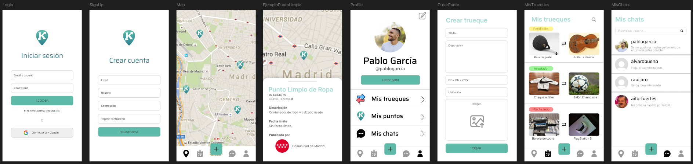

# Truekeo - Proyecto integrador del grado de DAM

Somos una plataforma de economía circular diseñada para facilitar la donación y el trueque a nivel local. A través de un mapa interactivo en tiempo real, los usuarios pueden localizar puntos oficiales de reciclaje o crear anuncios temporales para ofrecer objetos específicos a sus vecinos.

Nuestra misión es eliminar las barreras de la logística vecinal, permitiendo que instituciones y ciudadanos colaboren para reducir residuos y fortalecer el tejido social mediante el intercambio responsable.

### Equipo de proyecto:
[SM] **Scrum Master** [malmorox](https://github.com/malmorox) 
[CM] **Cloud Master**  [CodeByChriss](https://github.com/CodeByChriss) 
[DS] **Designer** [aiitttor](https://github.com/aiitttor)

## Prototipo (Figma)

El diseño inicial de la aplicación ha sido desarrollado en Figma, donde se ha definido la estructura visual, los flujos de navegación y las principales pantallas de la app.

🔗 [Enlace al prototipo en Figma](https://www.figma.com/design/iiBDX15OGVsRuzPoiFn4LV/Truekeo?node-id=0-1&t=ABp0jil8KM5YN9Hf-1)

## Metodología ágil SCRUM

El desarrollo del proyecto se está llevando a cabo siguiendo la metodología ágil SCRUM, organizando el trabajo en sprints para facilitar la planificación, el seguimiento y la entrega incremental de funcionalidades.

### Sprint 1 – Análisis y prototipado
Durante el primer sprint se sentaron las bases del proyecto, centrando el trabajo en la definición visual y conceptual de la aplicación.

***Objetivos alcanzados:***

- Definición de la idea y alcance del proyecto (con ayuda del profesor).
- Creación del prototipo de la aplicación.
- Diseño inicial de pantallas.

### Sprint 2 – Metodología de trabajo e inicio de interfaz

En el segundo sprint se ha comenzado con el desarrollo técnico del proyecto y la implementación de la interfaz.

***Objetivos en desarrollo / alcanzados:***

- Metodología de trabajo e inicio de la interfaz.
- Creación del proyecto en GitHub.
- Implementación de las pantallas de:
    - Login
    - Registro
    - Splash